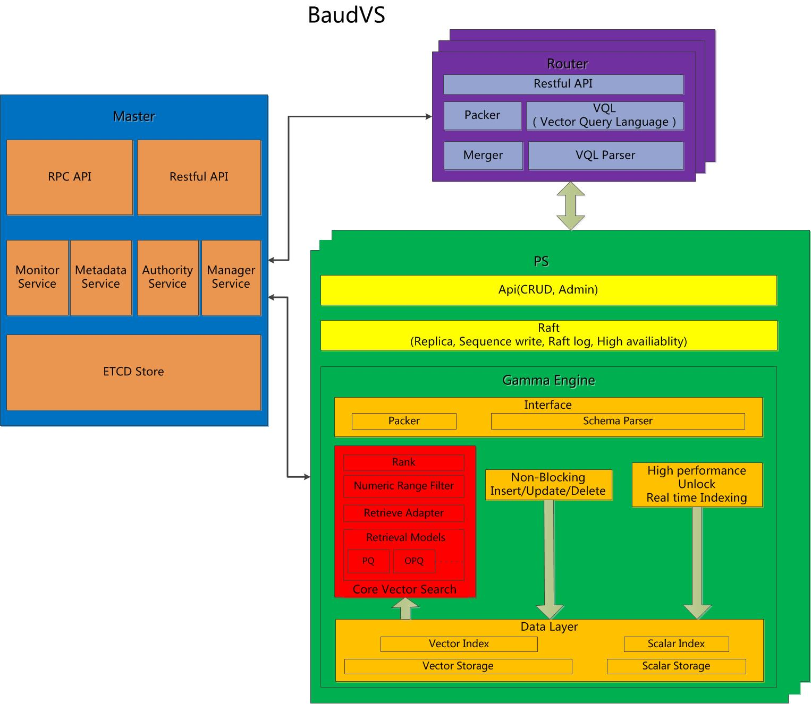

# Vectorsearch

Distributed deep learning vector search service

## Architecture



* Components

  > `master`, `router` and `partition service` 

* Master 

  > when you crate database or space you must use this service , default port is `8817` when you create dabase is only create a scope associate user permissions。
  >
  > when you create space ,the master will select relatively idel machine to create partition , when you delete space the master notice the related machines to delete local partition 

* Router

  > supports Elasticsearch 6+  resultful Client , also you can use restful to use it .`create`  , `delete`  `search` and `update` ， also when write document it routing function to related machine , to save it , you can define your routing args default is `_id` , and merge search multiple result to one result

* PartitionService (PS)

  > hosts document partitions, raft-based replication
  > two index engines `caprice` (full-text) and `gamma` (vector search) , when you create space , you will define it , default is `caprice`


## Base Example 

* create db named `vector_db`

```
curl -v --user "root:secret" -H "content-type: application/json" -XPUT -d'

{

    "name":"vector_db"

}

' http://$IP:8817/db/_create
```

* create space named `vector_space` 

```
curl -v --user "root:secret" -H "content-type: application/json" -XPUT -d'

{

    "name": "vector_space",

    "dynamic_schema": "strict",

    "partition_num": 1,

    "replica_num": 1,

    "engine": "gamma",

    "properties": {

        "name": {

            "type": "keyword"

        },

        "nature": {

            "type": "keyword"

        },

        "length":{

            "type": "integer"

        },

        "class":{

            "type": "integer"

        },

        "feature":{

            "type": "vector",

            "model_id": "word2vec",

            "dimension":200

        }

    }

}

' http://$IP:8817/space/vector_db/_create
```

* insert document 

```
curl -v --user "root:secret" -H "content-type: application/json" -XPOST -d'

{"feature":["feature":[-0.018388504,-0.063191935,-0.118808866,0.008206995,0.06746976,0.0065802634,0.020854017,0.035992254,-0.020127008,0.04850664,-0.020453088,0.14978069,-0.006704212,0.019925987,-0.028352445,0.11969988,0.0034988064,0.0116021,0.05202077,-0.09939458,-0.08558453,0.086143844,0.18008946,0.060280122,0.05124811,0.09891962,-0.03343239,-0.095093,-0.020068845,-0.04831084,-0.029026655,0.02116342,-0.07375928,0.036035936,0.107848436,-0.02691395,-0.07899638,-0.08288349,0.05223407,0.044417802,-0.006968146,-0.08200279,0.09119827,-0.03332201,-0.07108617,0.06350175,-0.0377754,-0.012335283,-0.034709223,0.08374366,-0.0068925885,-0.017702028,0.05851111,-0.08049848,-0.019078664,-0.1166361,0.12945986,-0.05052966,-0.013367654,0.0015378926,0.07833416,-0.027726691,0.101270944,0.13843939,-0.05807201,0.06771269,0.069979705,-0.059900492,-0.008140475,-0.082640484,-0.052576058,-0.14518866,0.06647153,0.15058829,-0.067517415,-0.016179493,-0.017223386,0.04229611,-0.005420745,-0.10701768,-0.055143762,-0.020505851,0.003903648,0.100450166,0.013232241,-0.0413542,-0.02085025,0.0018734697,-0.01515232,0.068399705,-0.018690655,0.14705524,-0.06811687,-0.054337993,0.01060701,0.10276712,0.113477066,-0.05677291,-0.053688537,0.043575983,0.131681,-0.08876566,0.0215446,-0.0139747495,-0.07632029,0.002860943,-0.08419807,-0.08482349,-0.17623185,-7.0861937E-4,0.0119266035,0.01441424,0.11472755,0.026504103,-0.075584345,-0.013263951,0.018950703,-0.14048058,0.008943944,-0.0063656904,-0.09234364,-0.07436921,-0.06413504,-0.016790695,0.08469058,-0.012837633,-0.05786915,-0.09617501,-0.0070968666,-0.010191282,-0.0664174,0.031355623,-0.118538305,-0.00806653,0.029324675,-0.035906494,-0.0041787196,-0.02848808,0.075440094,0.025711164,0.036554083,-0.071688436,0.02978931,0.017714843,0.007054673,-0.05985874,-0.2476933,-0.015957491,0.032624178,0.02588483,-0.008391492,0.0015040239,0.05978397,-0.04778364,-0.068509184,0.03742821,0.04649688,-0.037395667,-0.054779816,0.17835104,0.13884017,-0.07868833,-0.015199452,-0.029879967,0.025395695,0.014798877,0.069449,0.019689355,0.06360381,0.04758738,-0.08873937,0.043480884,0.01078659,-0.043828513,0.017222177,0.026595928,-0.029942498,-0.1757452,0.06884318,-0.021005357,0.111083455,-0.015514846,-0.10460577,0.037515674,0.0439676,0.09680452,0.06470732,0.014257333,-0.081672266,-0.09281627,-0.057595957,0.0069784815,0.064536534,0.02546824,0.015620763,-0.067690045,0.02617957,-0.08751394,0.19740644,0.049255934], "source":"hello"],"nature":"n","name":"vector","length":6,"class":1}

' $IP:9001/vector_db/vector_space
```


* search Document


```
{
	"query":{
        "sum":[
            {
                "vector": {
                    "field":"feature",
                    "fature": [-0.008776007,0.13750105,-0.076096505,0.0011332316,0.036164116,0.05675373,-0.18096787,0.015096902,-0.16109604,0.05062146,0.006022682,-0.045176137,-0.0020463953,-0.09453047,0.048205853,0.04447906,0.008241695,0.085013606,0.09380243,-0.110724084,-0.034690443,0.11221077,0.06266604,0.02290029,-0.054036118,-0.0679111,0.02227656,0.019889168,-0.029291948,-0.012131372,-0.054583747,0.023558874,0.0021900572,0.07279843,0.09910972,-0.012616325,-0.028063223,-0.086677134,0.02420948,-0.1564016,0.16494697,0.04182919,0.08840958,0.032775722,0.053971898,0.058215164,-0.12535521,-0.015190402,0.052465618,-0.013420158,0.043296542,-0.057317063,0.092385635,0.043031827,0.065932184,0.0061266306,0.17246453,0.096641734,0.017043006,-0.07050067,-0.0028387979,0.046441093,0.11683395,0.018657904,0.032503314,0.09292925,0.008587677,0.06450855,-0.06842567,-0.06226661,-0.017273912,-0.10240562,0.0484113,0.13467996,-0.013335751,-0.07149712,-0.041794445,0.033725753,0.02521781,-0.045280673,-0.08068863,0.011659034,-0.0071154893,-0.03631345,0.056412943,-0.022360954,-0.060209937,0.021102646,-0.08180059,0.07677139,-0.006242977,0.2162632,-0.1134748,0.011022405,0.01053094,0.028150108,-0.042429555,-0.043694384,-0.1275765,-0.02247865,0.051887985,-0.06908003,-0.04754962,-0.039401677,0.069016755,0.09129429,-0.1563287,-0.09369568,0.03710441,-0.04674737,-0.0511033,-0.023026902,-0.00032472017,-0.048332866,-0.14587502,-0.05788673,-0.08604911,-0.08472482,0.12045503,0.06478691,-0.08643147,-0.056325328,-0.030340595,0.065131426,0.07702991,0.049819227,-0.027378205,-0.010014153,-0.04079023,-0.011114984,-0.022188915,0.03217721,0.012728886,0.0061981925,0.086050324,0.0012232352,0.041784365,0.041043248,0.019994292,-0.0473967,0.070375614,-0.1490011,-0.010398935,-0.075013146,0.02232677,0.039015654,-0.116575696,-0.060721714,0.18074684,0.081293404,-0.12697658,0.06639249,0.024382189,0.020341065,0.02455752,-0.020020725,0.008761463,-0.0024479206,-0.17028898,0.06931095,0.021536756,0.011014242,0.0673915,-0.083584405,-0.04181053,-0.054002594,0.0024394472,0.10364755,0.02179315,0.0037677742,-0.024879375,0.1373038,0.052036755,0.012858442,0.02398866,-0.032740004,0.013597719,-0.09485791,0.062455427,-0.024757445,-0.038772218,-0.12112189,-0.054351132,0.0126870405,-0.022581166,0.065189205,-0.0021880802,-0.09873705,-0.09038636,-0.109913185,0.10220318,0.05305248,-0.12643342,-0.036164325,0.009072493,-0.010939095,0.030892706,-0.040437687,0.0013164396,0.020800276]
                }
            }
        ],
        "filter":[
            {
                "range" : {
                    "length" : {
                        "gte" : 0,
                        "lte" : 5
                    }
                }
            },
            {
                "term" : {
                    "name" :{
                        "value": "abc"
                    }
                }
            }
        ]
	}
}
```


## Internals

* [doc/Architecture.md](doc/Architecture.md)

## Roadmap

* [doc/Roadmap.md](doc/Roadmap.md)

## Quick start

#### Install

* [doc/Compile.md](doc/Compile.md)


* [doc/Install.md](doc/Install.md)

#### Database Api

* [doc/api/DB_Space.md](doc/api/master_db_space.md)

#### Document Api

* [doc/api/Document.md](doc/api/router_document.md)

#### Search Api

* [doc/api/Query.md](doc/api/router_query.md)
* [doc/api/Aggregation.md](doc/api/router_aggregation.md)


